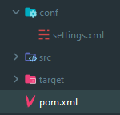

# Azion-API

## Install the API

To add the api to your plugin that's will be more complicated than usual because you need to authentificate you to github for download the api

### Maven

For authentificate you with maven you need to create an `settings.xml` just like the picture below.




When you have your settings file just copy the text below and replace `GITHUB_USERNAME`.
You need to replace `GITHUB_TOKEN` with you personal access token. If you don't know how to create an access token -> [Create a token](https://github.com/settings/tokens/new)
```xml
<settings xmlns="http://maven.apache.org/SETTINGS/1.0.0"
  xmlns:xsi="http://www.w3.org/2001/XMLSchema-instance" xsi:schemaLocation="http://maven.apache.org/SETTINGS/1.0.0
                      http://maven.apache.org/xsd/settings-1.0.0.xsd">

  <activeProfiles>
    <activeProfile>github</activeProfile>
  </activeProfiles>

  <profiles>
    <profile>
      <id>github</id>
      <repositories>
        <repository>
          <id>github</id>
          <url>https://maven.pkg.github.com/AzionTeam/AzionAPI</url>
          <snapshots>
            <enabled>true</enabled>
          </snapshots>
        </repository>
      </repositories>
    </profile>
  </profiles>

  <servers>
    <server>
      <id>github</id>
      <username>GITHUB_USERNAME</username>
      <password>GITHUB_TOKEN</password>
    </server>
  </servers>
</settings>
```

After that a basic installation of a dependency

```xml
  <repository>
    <id>github</id>
    <url>https://maven.pkg.github.com/AzionTeam/AzionAPI</url>
  </repository>
```

```xml
  <dependency>
    <groupId>fr.sothis.azionapi</groupId>
    <artifactId>azionapi</artifactId>
    <version>1.7-SNAPSHOT</version>
  </dependency>
```

### Gradle
For authentificate you with gradle just copy the text below and replace `GITHUB_USERNAME`.
You need to replace `GITHUB_TOKEN` with you personal access token. If you don't know how to create an access token -> [Create a token](https://github.com/settings/tokens/new)

```groovy
repositories {
    mavenCentral()
    maven {
        url = uri("https://maven.pkg.github.com/AzionTeam/AzionAPI")
        credentials {
            username = "GITHUB_USERNAME"
            password = "GITHUB_TOKEN"
        }
    }
}
```

And after you just add the implementation

```groovy
implementation group: 'fr.sothis.azionapi', name: 'azionapi', version: '1.5-SNAPSHOT'
```

## Managing API

The API need to be start and stop so you gets that method :

```java
public class Main extends JavaPlugin {

    @Override
    public void onEnable() {
        AzionAPI.start(this, "The Name Of Your Plugin");
    }

    @Override
    public void onDisable() {
        AzionAPI.stop();
    }
}
```

## Tool Box

### Tools :
    - Title Generator
    - Item Generator

### Title Generator

Can just have to use this line to send a title :

```java
AzionAPI.getInstance().sendTitle(player, title, chatColorTitle, subtitle, chatColorSubTitle, options);
```

Has you can see, I add options to parameters. You can just modify the fadeIn, stay and the fadeOut of the title.

```java
new TitleOptions(fadeIn: 2,stay: 5,fadeOut: 10)
```

### Item Builder

I add my personal ItemBuilder to the API.
For create an itemstack you just have to do this :

```java
ItemStack item = new ItemBuilder(material).toItemStack();
```

Just watch the class [ItemBuilder](https://github.com/AzionMC-team/Azion-API/blob/main/src/main/java/fr/azion/sothis/api/tools/ItemBuilder.java) to see all you can do with this tool !

## Database

### Managers

With the api you can edit or get user or grade and other in the future.
To the access to the manager you just have to write this line, of course change the end to get an other manager :D

```java
AzionAPI.getInstance().getUserManager();
```

### Methods

In all managers you have similar method like :

Get an object from the database:
```java
userManager.getUser(uuid);
```

Verify if your object exist in the database:
```java
userManager.isRegistered(uuid);
```

Update the object in the database:
```java
userManager.updateUser(user)
```

And a shortcut to fast update your object
```java
userManager.updateUser(uuid, user -> {
    user.setName("Chocolat");
})
```
